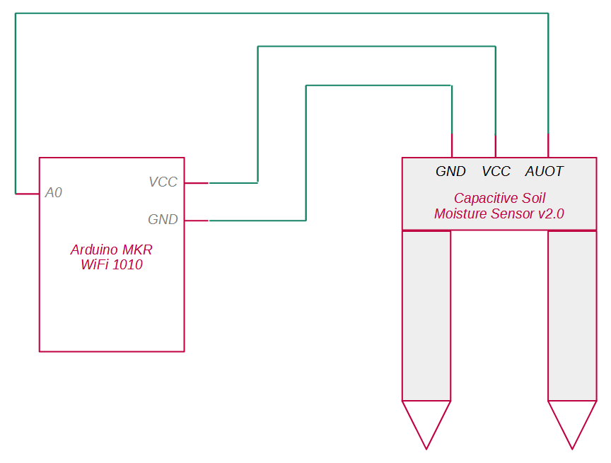
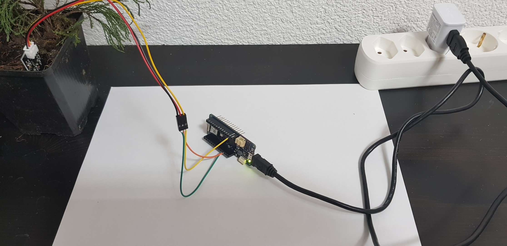
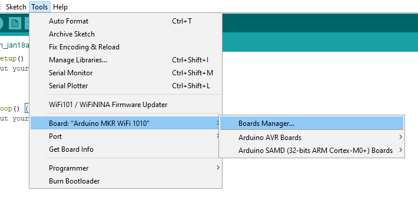
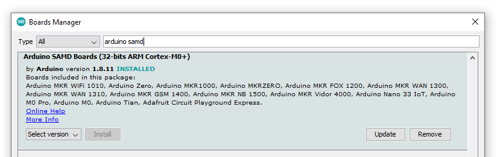
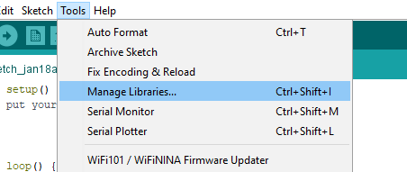
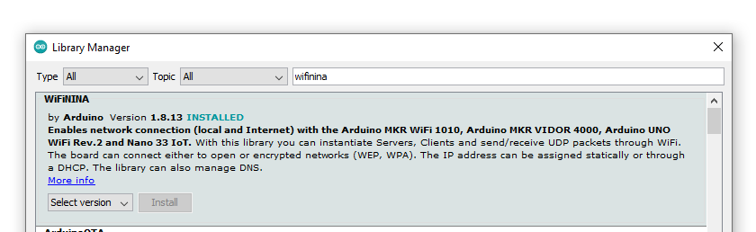
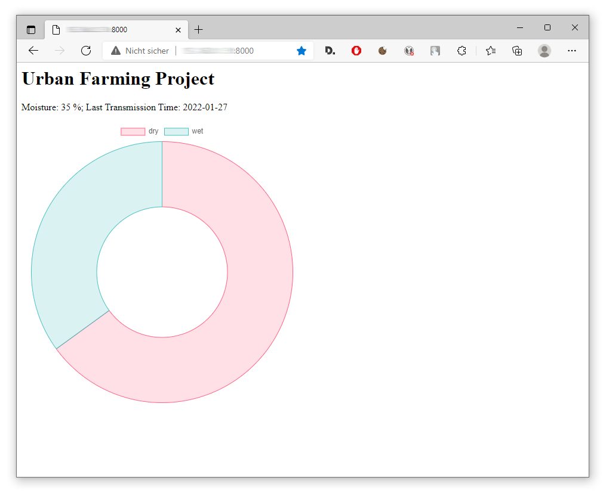

**Urban Farming soll in Zukunft helfen, die Ernährungsprobleme der Weltbevölkerung in urbanen Räumen zu reduzieren. Hierzu sollen hydroponische Vertikalgärten im städtischen Umfeld in grossem Stil angelegt werden. Da die Gärten vertikal verlaufen, verbrauchen sie relativ wenig Erdoberfläche. In diesem Workshop tauchen wir auf praktischem Weg in die Welt des Urban Farming ein.**

Singapur hat sich das Ziel gesetzt, wesentlich mehr der im Land benötigten Nahrung selbst zu produzieren. Da Singapur ein Inselstaat mit einer eng begrenzten Staatsfläche ist, spielt Urban Farming bei diesem Ziel eine zentrale Rolle. Das folgende Video gibt einen guten Einstieg in das Thema Urban Farming am Beispiel von Singapur:

> **📺 Video-Beitrag**
>
> **Thema:** Singapore's Bold Plan to Build the Farms of the Future  
> **Link:** [▶ Video auf YouTube öffnen](https://youtu.be/2ueVw83Plec)
>
> _Hinweis: Durch Klicken auf den Link verlassen Sie diesen Artikel und werden zu YouTube weitergeleitet. Dort gelten die Datenschutzbestimmungen von Google._

Durch den gezielten Einsatz von Technologie sollen urbane Farmen wesentlich ressourcenschonender bewirtschaftet werden, als dies bisher geschah. Um die Produktion zu optimieren, kommen datengestützte Regelsysteme zum Einsatz, mit denen Licht, Feuchtigkeit, Temperatur etc. gemessen und gesteuert werden.

Für Regelsysteme braucht es Sensoren. Einer der zentralen Sensoren des Urban Farming ist das Bodenfeuchte-Messgerät. In diesem Workshop wollen wir einen Bodenfeuchte-Sensor mit einem Mikrocontroller ansteuern und die Messdaten in einer Private Cloud bereitstellen. Dadurch sollen die Wasserbedürfnisse der Pflanze besser kontrolliert und daher besser bedient werden können. Am Ende werden wir dadurch auch noch bessere Botaniker. Im Roman "Der Marsianer" (von Andy Weir) sagte der auf dem Mars gestrandete Astronaut und Botaniker Mark Watney einmal:

> Ich will nicht arrogant erscheinen, aber ich bin der beste Botaniker auf diesem Planeten.

Wer weiss, was die Zukunft für Sie noch bringt. Damit auch Sie das mal von sich behaupten können, fangen Sie am besten noch heute mit den Übungen dieses Workshops an!

Es gibt bereits diverse Workshops zu Bodenfeuchte-Messgeräten, diese beziehen sich jedoch auf die Anbindung an eine Public Cloud (wie z.B. die Arduino Cloud). Wer jedoch auf ein hohes Mass an Datenschutz Wert legt und ein autarkes System benötigt (Stichwort: digitale Souveränität), möchte keine Public Cloud verwenden, sondern die Messdaten in der eigenen Private Cloud speichern. Für solch ein Szenario unterscheiden sich die Code-Beispiele im Vergleich zu denen der Workshops für eine Public Cloud erheblich.

Das Ziel in diesem Training soll ein selbst programmiertes Client-/Server-System sein, das Client-seitig aus einem Arduino-Mikrocontroller und Server-seitig aus einem beliebigen Computer (kann ein alter Laptop sein) mit einem Linux-Betriebssystem und einer Docker-Umgebung besteht. Es wird als gegeben vorausgesetzt, dass Sie bereits einen Server mit Ubuntu, Debian oder Raspberry Pi OS betreiben. Des Weiteren werden Grundkenntnisse in der Programmierung, insbesondere in C++ und JavaScript, vorausgesetzt.

## Das notwendige Material

Falls Sie das Beispiel praktisch zu Hause nachbauen möchten, werden noch folgende Hardware-Komponenten benötigt:

* Arduino MKR WiFi 1010 (~ CHF 26),
* Capacitive Soil Moisture Sensor v2.0 (~ CHF 7.-)
* Typ A Micro-USB-Kabel und einige Jumperkabel
* Linux-Server (kann z.B. ein alter Laptop sein oder ein Raspberry Pi)

Diese lassen sich in diversen Online-Shops oder beim Elektronik-Fachhändler erhaschen.

## Die Verdrahtung

Sobald alle Komponenten beisammen sind, kommen wir zur praktischen Ausführung: Als erstes kann der Mikrocontroller mit dem Sensor verdrahtet werden. Dies ist recht einfach erledigt, es werden nur drei Pins beim Arduino benötigt, die anzukabeln sind. Das dazugehörige Schaubild hat die folgende Form:



Der _VCC_-Pin am Arduino ist hierbei die Quelle des elektrischen Stroms für den Sensor. Der _GND_-Pin am Arduino ist die Stromsenke. _A0_ ist Pin über den wir den Sensor auslesen werden. Der Sensor sendet die gemessenen Werte über seinen _AUOT_-Ausgang an den _A0_-Pin. In welcher Form die Signale dort ankommen, und wie wir sie interpretieren können, behandeln wir weiter unten.

In der Realität kann das Bastel-Ergebnis zum obigen Schaltplan dann so aussehen (so sieht es zumindest bei mir aus):



Der Arduino wird per USB-B-Anschluss an einer Steckdose mit dem Haushaltsstrom verbunden. Bitte achten Sie darauf, den Bodenfeuchte-Sensor tief in die Erde zu schieben, sodass nur noch einer kleiner Teil des Sensors aus dem Boden "schaut". Der Sensor hat eine Markierung aufgedruckt (quer verlaufende Linie), die anzeigt, bis zu welcher Tiefe der Sensor hineingesteckt werden sollte.

Nun benötigen wir noch eine Firmware auf dem Arduino, die uns die Sensordaten regelmässig ausliest und diese immer gleich an unsere Private Cloud sendet. Diese Firmware programmieren wir selbst. In der Private Cloud wird ein Webservice laufen, an den wir die Daten senden können. Diesen bereiten wir jedoch erst im darauffolgenden Schritt vor. Aktuell nehmen wir ihn einfach als gegeben an und programmieren den Arduino darauf hin.

## Programmierung des Mikrocontrollers

Zum Programmieren verwende ich die Arduino IDE. Um den Arduino MKR WiFi 1010 von der IDE aus ansteuern zu können, können wir die entsprechende Board-Definition über den Board Manager der IDE nachladen. Wir öffnen daher den Board Manager:



Im Board Manager suchen wir nach "arduino samd" und installieren das Board-Package "Arduino SAMD Boards (32-bits ARM Cortex-M0+)":



In der Beschreibung des Packages sehen wir schon, dass "Arduino SAMD" genau das richtige Package für den Arduino MKR WiFI 1010 ist (siehe Bild oben).

Das schöne am Arduino MKR WiFi 1010 ist, dass es das WiFi-Modul bereits mitbringt, es lässt sich damit also direkt eine WiFi-Verbindung herstellen. Um dieses Modul verwenden zu können, können wir in der Arduino IDE die entsprechende Library installieren. Wir öffnen in der Arduino IDE den Library Manager:



Im Library Manager suchen wir nach "wifinina" und installieren die Library "WiFiNINA" durch Klicken auf den "Install"-Button nach:



Auch hier sehen wir in der Library-Beschreibung, dass das "WiFiNINA" die passende Programmier-Bibliothek für den Arduino MKR WiFI 1010 ist (siehe Bild oben).

Nun haben wir unsere Entwicklungs-Umgebung für dieses Projekt eingerichtet und können mit dem Programmieren der Firmware im bereits automatisch geöffneten Arduino Sketch (im Text-Editor-Fenster) beginnen. Als erstes inkludieren wir die oben erwähnte WiFiNINA-Bibliothek und instanziieren ein WiFiClient-Objekt als globale Variable:

```c++
#include <WiFiNINA.h>

WiFiClient wifiClient;
...
```

Zwar könnten wir das WiFiClient-Objekt auch erst in einer der noch folgenden Funktionen instanziieren, aber die Praxis hat gezeigt, dass es nur als globale Variable stabil funktioniert.

Als nächstes realisieren wir die `setup()`-Funktion des Arduino. Diese wird einmalig beim Aufstarten des Arduino ausgeführt und hat in unserem Fall nur den folgenden Inhalt:

```c++
...
void setup() {
  int wifiStatus = WL_IDLE_STATUS;
  while (wifiStatus != WL_CONNECTED) {
    wifiStatus = WiFi.begin("...", "...");
    delay(10000);
  }
}
...
```

Wir verwenden also die Funktion ausschliesslich dazu, um die WiFi-Verbindung zu etablieren. Dies geht ganz einfach über die `WiFi.begin()`-Funktion aus der WiFiNINA-Bibliothek. Um eine Verbindung herstellen zu können, müssen wir der Funktion sowohl den Namen (als ersten Funktionsparameter) als auch das Passwort (als zweiten Parameter) unseres WiFi-Routers als Zeichenkette mitgeben.

Da der Verbindungsaufbau meist auf Anhieb nicht gelingt, wiederholen wir diesen Funktionsaufruf alle _10&nbsp;s_ so oft bis es gelingt und gehen dann erst im Code weiter. Um dies zu bewerkstelligen, instanziieren wir eine lokale Hilfsvariable `wifiStatus`, die initial den Wert `WL_IDLE_STATUS` (also "nicht-verbunden") zugewiesen bekommt. Die `while`-Schleife wiederholt solange bis `wifiStatus` den Wert `WL_CONNECTED` erhält. `wifiStatus` wird bei jedem Schleifendurchlauf durch den Rückgabewert der `begin()`-Funktion neu gesetzt. Nach jedem Verbindungsversuch warten wir _10&nbsp;s_ (_10'000&nbsp;ms_) durch den Aufruf der `delay()`-Funktion.

Als nächstes realisieren wir den Inhalt der `loop()`-Funktion des Arduino. Diese wird vom Arduino nach der `setup()`-Funktion aufgerufen und, wie der Funktionsname schon andeutet, immer weiter wiederholt (solange, bis wir den Netzstecker des Arduino ziehen). Den Inhalt der `loop()`-Funktion beginnen wir mit der Zuweisung der Zeichenkette `serviceAddress`:

```c++
...
void loop() {
  char serviceAddress[] = "684.236.0.506";
  if (wifiClient.connect(serviceAddress, 8000)) {
    ...
  }
}
```

Hierbei ist die IP-Adresse oder der Domainname, unter dem der Webservice laufen wird, zu setzen. Aktuell ist das die Adresse unseres eingangs erwähnten Linux-Servers. Die IP-Adresse können wir herausfinden, indem wir auf dem Server

```bash
ifconfig
```

aufrufen. Wir verwenden hier also explizit keinen Webservice aus der Public Cloud, sondern einen selbst-gehosteten Webservice.

Im nächsten Schritt stellen wir durch Verwendung der `connect()`-Methode am eingangs instanziierten wifiClient-Objekt eine Verbindung zum Webservice unter dem Port _8000_ her. Nur wenn das funktioniert und die Methode eine erfolgreiche Verbindung hergestellt hat, steigen wir in die Hauptfunktionalität unseres Codes ein. Dies wird durch die `if`-Bedingung sichergestellt.

Innerhalb der `if`-Verzweigung lesen wir als erstes den aktuellen Wert des Bodenfeuchte-Sensors aus:

```c++
..
int sensorPin = A0;
int moisture0To1023 = analogRead(sensorPin);
int moisturePercentage = map(moisture0To1023, 0, 1023, 100, 0);
...
```

Wir bestimmen zunächst die PIN-Nummer, an dem der Bodenfeuchte-Sensor angeschlossen ist. Da dies der PIN "A0" ist, weisen wir unserer lokalen Variablen sensorPin den Wert der bereits vordefinierten globalen Variable A0 zu. Im nächsten Schritt lesen wir den aktuellen Sensorwert durch den Aufruf der globalen Arduino-Funktion `analogRead()` aus und speichern das Ergebnis in unserer Variablen `moisture0To1023`.

Die Bezeichnung "analogRead" ist evtl. etwas irreführend, denn natürlich handelt es sich auch hierbei um digitale Sensorwerte. Aber der Arduino hat zwei grundlegend unterschiedliche Modi, um Sensorwerte auszulesen. Das eine ist der "Digital Read", bei dem die Werte nur _0_ oder _1_ sein können. Oder aber eben "Analog Read", bei dem die Werte im Wertebereich zwischen _0_ und _1023_, also wesentlich ausdifferenzierter, dargestellt werden können.

Beim Bodenfeuchte-Sensor bedeutet der Wert _1023_, dass der Boden ganz trocken ist, der Wert _0_ repräsentiert die maximal messbare Durchfeuchtung des Bodens. Um diese Werte "menschenlesbarer" zu gestalten, wäre eine Übertragung auf einen Bereich von _0_ bis _100_ sinnvoll, sodass die Werte einen Prozentsatz der Bodenfeuchte repräsentieren.

Hierzu bietet sich die globale Arduino-Funktion `map()` an, mit der eine entsprechende Werte-Transformation durchgeführt werden kann. An die `map()`-Funktion wird als erster Parameter der zu transformierende Wert übergeben. In unserem Fall ist das die Variable `moisture0To1023`. Als zweiter und dritter Parameter wird der Wertebereich der Eingangswerte angegeben, dies ist in unserem Fall 0 und 1023. Als vierter und fünfter Parameter braucht es dann noch den Wertebereich der Zielwerte, in unserem Fall _100_ und _0_. Die Reihenfolge (zuerst _100_, dann _0_) ist hier wichtig, da der Bodenfeuchte-Sensor die Werte invers zu den Prozentwerten liefert, d.h. der Ausgangswert _1023_ sind _0%_ und der Ausgangswert _0_ sind _100%_. Das Ergebnis von `map()` speichern wir in der Variable `moisturePercentage`.

Als nächstes konvertieren wir die dezimale Ganzzahl `moisturePercentage` in eine Zeichenkette (Variable `moisturePercString`), um diese später an den Webservice liefern zu können:

```c++
...
char moisturePercString[] = "000";
itoa(moisturePercentage, moisturePercString, 10);
...
```

Die globale Funktion `itoa()` konvertieren eine Ganzzahl in eine Zeichenkette (`itoa` steht für "integer to ASCII"). Als Parameter der Funktion werden die Ausgangsvariable (die Ganzzahl), die Zielvariable (die Zeichenkette), sowie die Basis des zu verwendenden Zahlensystems angegeben. Bei letzterem geben wir hier _10_ an, da die Basis des Dezimalsystems eben _10_ lautet.

Der Webservice, den wir weiter unten noch programmieren werden, wird Sensorwerte durch eine HTTP-GET-Anfrage in der Form:

```
http://684.236.0.506:8000/?moisture=56
```

annehmen können. Das heisst, der Feuchtigkeits-Prozentwert wird vom Client in der URL der GET-Anfrage als Teil des Query-Strings mitgeliefert (`moisture=56`). Die Zahl _56_ in dem obigen Beispiel bedeutet also _56&nbsp;%_ Bodenfeuchtigkeit.

Diese GET-Anfrage wird im HTTP-Protokoll als folgende mehrzeilige Zeichenkette formuliert:

```
GET /?moisture=56 HTTP/1.1
Host: 684.236.0.506
Connection: close 
```

Wir beginnen also mit der Zusammenstellung der ersten Zeile dieser Zeichenkette mit dem folgenden Code:

```javascript
...
char queryUrl[] = "GET /?moisture=";
strcat(queryUrl, moisturePercString);
strcat(queryUrl, " HTTP/1.1");
wifiClient.println(queryUrl);
...
```

Die Variable `queryUrl` soll die Zeichenkette der GET-Anfrage beinhalten. Mit der `strcat()`-Funktion können zwei Zeichenketten verbunden werden ("concatenate strings"). Durch wiederholten Aufruf von `strcat()` bauen wir also den Feuchtigkeitswert in die Zeichenkette ein. Zum Schluss senden wir diese Zeichenkette als erste Zeile an den Datenstrom in Richtung des Services indem wir die Zeichenkette an die `println()`-Methode des `wifiClient`-Objekts übergeben.

Im nächsten Schritt bauen wir die zweite Zeile des HTTP-Requests zusammen und senden diese an den Service:

```javascript
...
char hostString[] = "Host: ";
strcat(hostString, serviceAddress);
wifiClient.println(hostString);
...
```

In diese Zeichenkette wird, wiederum durch die Verwendung von `strcat()`, die Adresse des Ziel-Servers (steckt bereits in der Variablen `serviceAddress`) integriert.

Zu guter Letzt senden wir noch die Zeile, die den Abschluss des Datenpakets markiert und noch eine leere Zeile hinterher:

```javascript
...
wifiClient.println("Connection: close");
wifiClient.println();
wifiClient.flush();
...
```

Die `flush()`-Methode sorgt dafür, dass der Datenstrom sofort abgesendet wird. Dadurch stellen wir sicher, dass die Daten sofort an dieser Stelle gesendet werden. Würden wir an dieser Stelle den Datenstrom nicht "spülen", hätten wir keine Kontrolle darüber, wann und ob die Anfrage überhaupt abgesendet wird.

Ganz zum Schluss in der `loop()`-Funktion geben wir Arduino noch mit, am Ende einen halben Tag bis zum nächsten Durchlauf zu warten:

```javascript
...
delay(43200000);
...
```

Wir verwenden hierzu die globale `delay()`-Funktion des Arduino. Diese stoppt den Programm-Ablauf und wartet die Anzahl der angegebenen Millisekunden auf Basis des lokalen Zeitmessers im Arduino ab. Um also z. B. einen halben Tag (_12&nbsp;Std._) zu warten, sind _43.2&nbsp;Mio.&nbsp;ms_ notwendig (_12&nbsp;Std. * 60&nbsp;min * 60&nbsp;sec * 1000&nbsp;ms = 43'200'000&nbsp;ms_).

Ich habe für mich einfach mal festgelegt, dass es mir vollkommen genügt, wenn ich nur 2x am Tag eine aktuelle Messung der Bodenfeuchte durchführe und diese sende. Dies schont das Netzwerk-Verkehrsaufkommen und reduziert den Stromverbrauch des Arduino merklich. Je nach Anwendung und Pflanze sind evtl. aber auch höhere oder niedere Messfrequenzen sinnvoll.

Damit ist unser Sketch für den Arduino fertiggestellt. Im übrigen finden Sie das vollständige Code-Beispiel in meinem Open-Source-Repository "urban-farming" auf Github:

> **📖 GitHub-Repo: Arduino Moisture Sensing for the Private Cloud**
>
> _An Arduino moisture sensing setup with private cloud connectivity._
>
> **[▶ edgarbutwilowski/urban-farming bei GitHub](https://github.com/edgarbutwilowski/urban-farming)**

Falls also etwas nicht funktionieren sollte, können Sie dies mit dem Repository abgleichen. Dies Inhalte des Repositories habe ich getestet, der Code sollte funktionieren. Der oben beschriebene Arduino Sketch ist im Wurzelverzeichnis des Repositories in der Datei "urban_farming_client.ino" zu finden. Falls etwas doch nicht funktionieren sollte, können Sie mich gerne kontaktieren, gemeinsam finden wir sicherlich den Fehler!

## Programmierung des Webservice

Mit der Programmierung des Clients sind wir nun fertig. Ohne einen Service funktioniert unser Aufbau jedoch nicht. Recht zügig lässt sich ein Webservice mit der _Node.js_-Plattform entwickeln. Wir benötigen daher in unserer Entwicklungs-Umgebung eine Installation von _Node.js_ und _NPM_. Im Ubuntu-Betriebssystem lassen sich diese ganz einfach mit folgenden Befehlen auf der Befehlszeile installieren:

```bash
apt-get install nodejs
apt-get install npm
```

Für Windows stehen Installationsroutinen zum Download bereit. Nach der Installation erstellen wir an beliebiger Stelle auf unserem Entwicklungs-Rechner einen leeren Ordner z.B. mit dem Namen "urban-farming" an. Wir wechseln in den Ordner und besorgen uns zunächst die "nodemailer"-Bibliothek, indem wir den entsprechenden NPM-Befehl im Ordner ausführen:

```bash
npm install --save nodemailer
```

Die nodemailer-Bibliothek können wir später verwenden, um vom Service aus automatisiert Erinnerungs-E-Mails an uns selbst zu versenden, wenn die Erde zu trocken geworden ist.

Des Weiteren legen wir im neu erstellten "urban-farming"-Ordner eine neue JavaScript-Datei z.B. mit dem Namen "service.js" an. Diese Datei wird den gesamte Quelltext für unseren Webservice enthalten. Die Node.js-Umgebung kann diese JavaScript-Datei Server-seitig ausführen. Wir beginnen die service.js-Datei mit dem Import der von unserem Webservice zu verwendenden Bibliotheken:

```javascript
const http = require("http");
const url = require("url");
const nodemailer = require("nodemailer");
...
```

Die "http"-Bibliothek werden wir benötigen, um die HTTP-Requests, die vom Arduino kommen, empfangen zu können. Die Bibliothek "url" benötigen wir, um die URL, die vom Arduino am Service aufgerufen wird, untersuchen zu können. Die "nodemailer"-Bibliothek benötigen wir zum Versenden einer Erinnerungs-Mail.

Im nächsten Schritt instanziieren wir einige globale Variablen:

```javascript
...
let moisture = 0.0;
let time = "";
const hostAddress = "0.0.0.0";
const portNo = 8000;
...
```

In `moisture` soll der durch den Service empfangene Feuchtigkeits-Prozentsatz im Arbeitsspeicher gespeichert werden. In `time` soll das Datum des letzten Datenempfangs gespeichert werden. Diese beiden Variablen werden initial mit "leeren" Werten aufgefüllt ("0.0" und leere Zeichenkette). Des Weiteren geben wir unter der Konstante `hostAddress` die IP-Adresse an, unter der unser Webservice sich melden darf. Die IP-Adresse "0.0.0.0" ist dabei eine Art "Wildcard" und bedeutet, dass die IP-Adresse des Webservices beliebig sein darf. Mit der Konstante `portNo` konfigurieren wir die Postnummer auf den Port 8000.

Um einen HTTP-Server in Node.js zu entwickeln, können wir zunächst eine Callback-Funktion schreiben. Diese Callback-Funktion übergeben wir später an das Objekt des HTTP-Servers. Der HTTP-Server ruft die von uns geschriebene Callback-Funktion bei jedem Aufruf durch einen Client auf.

Wir beginnen also mit der Definition der Callback-Funktion, diese nennen wir z.B. `requListen` (für "request listener"):

```javascript
...
const requListen = (requ, resp) => {
  ...
};
...
```

Was machen wir innerhalb des Request-Listeners? Als erstes parsen wir die URL:

```javascript
...
const urlObj = url.parse(requ.url, true).query;
...
```

Dazu verwenden wir das `requ`-Objekt, das uns der HTTP-Server als Parameter der Callback-Funktion liefern wird. Beim requ-Objekt handelt es sich um das Objekt, das den Request repräsentiert. Die URL des Aufrufs hängt am `url`-Attribut des _Request_-Objekts (`requ.url`). Wir übergeben die URL an die `parse()`-Methode der url-Bibliothek, damit diese die URL in ein JavaScript-Objekt (`urlObj`) umwandeln kann. Der zweite Parameter gibt vereinfacht gesagt an, ob die zu parsende URL eine Host-Adresse enthält, oder nicht. In unseren Fällen trifft das zu, also: `true`. Das resultierende JavaScript-Objekt repräsentiert die URL in Form eines Objekts.

Nun können wir ganz leicht den übergebenen Wert der Bodenfeuchtigkeit aus der URL auslesen, indem wir am `urlObj` das moisture-Attribut abfragen:

```javascript
...
if(urlObj.moisture) {
  moisture = Number(urlObj.moisture);
  time = new Date().toISOString().slice(0, 10);
  resp.writeHead(200);
  resp.end();
  ...
}
```

Nur wenn das `moisture`-Attribut geliefert wurde, also nicht undefined ist, machen wir mit unserem Service überhaupt weiter. Wir wandeln zunächst die `moisture`-Zeichenkette, die wir aus der URL erhalten haben, mit der globalen JavaScript-Funktion `Number()` in einen _numerischen Datentyp_ um und speichern diese in unserer eigenen globalen `moisture`-Variablen.

Anschliessend lassen wir uns die aktuelle Server-Zeit geben, indem wir ein Objekt vom Typ `Date` erzeugen. Wir lassen uns durch Aufruf der Methode `toISOString()` direkt die ISO-Zeichenketten-Repräsentation des `Date`-Objekts geben und schneiden mit der Methode `slice()` aus diesem Datums- und Zeit-Text nur das Datum heraus, das sich in den Zeichen von _0_ter bis _10_ter Stelle befindet. Das Ergebnis speichern wir wiederum in der globalen `time`-Variable. Dort steht dann im Ergebnis so etwas wie "_2022-01-26_" als Zeichenkette. Anmerkung: Ich hatte ursprünglich vor, in dieser Variable auch die Zeit mitzuspeichern, daher heisst die Variable noch time, eigentlich müsste sie mittlerweile passenderweise date heissen.

Nachdem wir aus dem HTTP-Request die für uns wichtigen Informationen ausgelesen haben, antworten wir dem Client brav mit dem HTTP-Code _200_ (dieser bedeutet: Alles okay!), indem wir diesen an das HTTP-Response-Objekt (`resp`) übergeben. Unser Arduino-Client wertet diesen Rückgabe-Code zwar sowieso nicht aus, aber andere Clients könnten das vielleicht tun.

Da wir den Bodenfeuchte-Wert nun erhalten haben, können wir auf dessen Basis entscheiden, ob wir eine Meldung per E-Mail an uns selbst senden, um uns zu erinnern, die Pflanze zu giessen. Wir können uns dabei für einen Schwellenwert entscheiden, ab dem wir eine Meldung erhalten möchten. Dies könnten z.B. _35%_ sein. Wenn also die Bodenfeuchtigkeit unter _35%_ sinkt, erhalten wir eine Erinnerungs-Mail.

Zu diesem Zweck prüfen wir per `if`-Verzweigung, ob die globale Variable `moisture` sich unter dem Schwellenwert _35.0_ befindet:

```javascript
...
if(moisture < 35.0) {
  let transport = nodemailer.createTransport({
    host: "smtp.mailserver.com",
    secureConnection: false,
    port: 587,
    auth: {
      user: "mailaddress",
      pass: "password"
    },
    tls: {
      ciphers: 'SSLv3'
    }
  });
  ...
}
...
```

Wir können den Schwellenwert auch auf einen anderen Betrag setzen, hier braucht es Erfahrungswerte! In diesem Beispiel bleiben wir einfach beim Wert _35_.

Wenn also die Bodenfeuchtigkeit unter _35%_ sinkt, wird in unserem Service-seitigen Code eine E-Mail vorbereitet. Dazu verwenden wir die oben bereits erwähnte "nodemailer"-Bibliothek. Die zentrale Initialisierungs-Methode ist hier `createTransport()`. Dieser Methode können wir ein Objekt übergeben, das die zu verwendende Absender-Mail-Adresse konfiguriert. In dem obigen Codeschnipsel sind noch einige Attribute mit konkreten Werten der E-Mail-Adresse auszufüllen, die Sie als Absender-Adresse verwenden möchten, damit das Beispiel funktioniert.

In meinem persönlichen Aufbau funktioniert nodemailer wunderbar in Kombination Outlook.com als Mail-Anbieter. Ich habe auf _outlook.com_ ein Konto registriert und am Objekt-Attribut host im obigen Codeabschnitt den SMTP-Server von Outlook.com eingetragen:

```
host: "smtp-mail.outlook.com"
```

Bei user ist der entsprechende Benutzername des E-Mail-Kontos (meist die E-Mail-Adresse selbst) und bei pass das Passwort des E-Mail-Kontos einzutragen. Die restlichen Attribute können so belassen werden, wie sie sind.

Als nächstes können wir die Erinnerungs-Mail vorbereiten, die wir via _nodemailer_ senden möchten, wenn die Pflanze auszutrocknen droht:

```javascript
...
let mailOpt = {
  from: "mailaddress",
  to: "mailaddress",
  subject: "Your plant needs water",
  text: "The moisture of the plant is at " + moisture + " %."
};
...
```

Anzugeben sind die Absender-Mail-Adresse im Attribut `from`. Diese ist meist identisch mit dem oben bereits gesetzten `user`-Attribut, also die Mail-Adresse des Absender-Kontos. Des Weiteren geben wir die Empfänger-Mail-Adresse im `to`-Attribut an. Dies ist die Mail-Adresse des Kontos, an dem wir über den drohenden Austrocknungs-Zustand erinnert werden wollen. Zum Beispiel kann es das Mail-Konto sein, an dem wir die E-Mails auch auf dem Smartphone erhalten, sodass wir am Smartphone gleich daran erinnert werden.

In `subject` geben wir noch den Betreff der Mail an und im `text` platzieren wir den textuellen Inhalt der Mail. Im letzteren platzieren wir den aktuellen Wert der `moisture`-Variable, sodass wir eindeutig daran erinnert werden, wie schlecht es der Pflanze bald geht, wenn wir nicht tätig werden (als wirksamer Motivator).

Nun können wir die Mail versenden, indem wir die `sendMail()`-Methode am oben erzeugten `transport`-Objekt aufrufen und das `mailOpt`-Objekt, sowie eine anonyme Callback-Funktion als Parameter mitgeben:

```javascript
...
transport.sendMail(mailOpt, (err, message) => {
  // do nothing
});
...
```

In der Callback-Funktion könnten wir z.B. auswerten, ob der Mailversand erfolgreich war, oder einen Fehler zurückgab. Ich habe sie in dem Beispiel zwar vorbereitet, jedoch leer gelassen. In dem Fall machen wir mit dem Rückgabewert also nichts, könnten es uns aber jeder Zeit auch anders überlegen. 

Nun kommen wir zum `else`-Teil der `if`-Verzweigung. Dieser Bereich wird nur dann aufgerufen, wenn in der aufrufenden URL kein `moisture`-Wert geliefert wurde, also z.B. wenn die aufrufende URL so aussieht:

```
http://684.236.0.506:8000/
```

Dies ist vorgesehen für einen Aufruf des Webservices von einem Browser aus. Hierbei soll eine Info-Webseite angezeigt werden, die in einem Diagramm übersichtlich zeigt, wie der aktuelle Feuchtigkeitsstand ist. Hier ein Beispiel:



Die Webseite stellt einfach nur den Wert der Bodenfeuchte, das Datum des Datenempfangs und ein Ringdiagramm dar. Das Ringdiagramm gibt auf übersichtliche Weise den prozentualen Anteil der Bodenfeuchte wieder. Der Anteil der Feuchte wird dabei türkis dargestellt ("wet"), der Anteil der Austrocknung wird pink dargestellt ("dry").

Um diese HTML-Seite zu liefern, bereiten wir im `else`-Teil zunächst wieder den Code 200 (alles okay) als Rückgabe-Code vor:

```javascript
...
else {
  resp.writeHead(200);
  ...
}
...
```

Danach erstellen wir die HTML-Webseite selbst und speichern diese in der Zeichenketten-Variablen html:

```javascript
let html = "<html><head>\r\n";
html += "<script src=\"https://cdn.jsdelivr.net/npm/chart.js@3.7.0/dist/chart.min.js\"></script>\r\n"
html += "</head><body>\r\n";
html += "<h1>Urban Farming Project</h1>\r\n";
html += "<p>Moisture: " + moisture + " %; Last Transmission Date: " + time + "</p>\r\n";
html += "<div style=\"width: 50%;\">\r\n";
html += "<canvas id=\"gardenChart\"></canvas>\r\n";
html += "</div>\r\n";
html += "<script>\r\n";
html += "const ctx = document.getElementById('gardenChart').getContext('2d');\r\n";
html += "const gardenChart = new Chart(ctx, {\r\n";
html += "type: 'doughnut',\r\n";
html += "data: {\r\n";
html += "  labels: ['dry', 'wet'],\r\n";
html += "   datasets: [{\r\n";
html += "        label: 'Moisture',\r\n";
html += "        data: [" + (100.0 - moisture) + ", " + moisture + "],\r\n";
html += "       backgroundColor: [\r\n";
html += "            'rgba(255, 99, 132, 0.2)',\r\n";
html += "            'rgba(75, 192, 192, 0.2)',\r\n";
html += "        ],\r\n";
html += "        borderColor: [\r\n";
html += "            'rgba(255, 99, 132, 1)',\r\n";
html += "           'rgba(75, 192, 192, 1)',\r\n";
html += "        ],\r\n";
html += "        borderWidth: 1\r\n";
html += "    }]\r\n";
html += " },\r\n";
html += "options: {\r\n";
html += "}\r\n";
html += "});\r\n";
html += "</script></body>\r\n";
```

Im Anschluss hieran senden wir die HTML-Seite an den Client, durch den Aufruf der `end()`-Methode am Response-Objekt mit der `html`-Zeichenkette als Parameter:

```
resp.end(html);
```

Der obige Abschnitt, in dem wir das HTML erzeugen, sieht recht verwirrend aus. Dies liegt daran, dass wir die HTML-Seite in "kleinen Häppchen" als einzelne Zeichenketten-Abschnitten zusammenbauen müssen. In einer professionellen Umgebungen würde so nicht vorgegangen werden. Hier bieten sich stattdessen spezielle Client-Frameworks an, in denen die Webseiten nativ geschrieben werden können. Gerade bei grösseren Web-UI-Projekten käme man ohne solche Frameworks schnell in "Teufel's Küche". Aber für unser kleines Beispiel können wir es ausnahmsweise "quick and dirty" erledigen und das HTML in einzelnen Zeichenketten "zusammenschrauben".

Wenn wir uns den Inhalt der finalen Zeichenkette `html` anschauen, so ergibt sich die folgende HTML-Webseite, die bei einer Anfrage an den Webbrowser ausgeliefert werden würde:

```html
<html>
<head>
  <script src="https://cdn.jsdelivr.net/npm/chart.js@3.7.0/dist/chart.min.js">
  </script>
</head>
<body>
  <h1>Urban Farming Project</h1>
  <p>Moisture: {{ moisture }} %; Last Transmission Time: {{ time }}</p>
  <div style="width: 50%;">
    <canvas id="gardenChart"></canvas>
  </div>
  <script>
    const ctx = document.getElementById('gardenChart').getContext('2d');
    const gardenChart = new Chart(ctx, {
    type: 'doughnut',
    data: {
      labels: ['dry', 'wet'],
        datasets: [{
          label: 'Moisture',
          data: [65, 35],
         backgroundColor: [
            'rgba(255, 99, 132, 0.2)',
            'rgba(75, 192, 192, 0.2)',
          ],
          borderColor: [
            'rgba(255, 99, 132, 1)',
           'rgba(75, 192, 192, 1)',
          ],
          borderWidth: 1
            }]
         },
        options: {
      }
    });
  </script>
</body>
```

In einem Webbrowser ausgeführt ergibt dies die oben im Screenshot bereits vorgestellte Webseite. In der HTML-Seite verwenden wir wiederum Client-seitigen JavaScript-Programmiercode, mit dem wir das Ringdiagramm erstellen. Hierzu verwenden wir die beliebte _Chart.js_-Bibliothek, die wir im Kopf-Bereich der HTML-Seite importieren. Danach integrieren wir ein `<canvas>`-Element mit einer bestimmten Element-ID (z.B. `"gardenChart"`) in die Webseite. Das `<canvas>`-Element ist eine frei verwendbare Zeichenfläche, in die die Chart.js-Bibliothek das Diagramm hineinzeichnen kann. Auf diese Weise können wir aus unserem dann folgenden JavaScript-Code heraus das `<canvas>`-Element referenzieren und das Ringdiagramm (in der Sprache von Chart.js `"doughnut"` genannt) definieren.

Bei der Definition des Ringdiagramms ist zentral, dass wir im Attribut `data` den jeweils aktuellen Wert der Bodenfeuchtigkeit eintragen. Wir sollten hier sowohl den Wert Feuchtigkeit als auch den Wert der "Trockenheit" angeben. Der Wert der Trockenheit ergibt sie dabei als prozentualer Restwert zur Feuchtigkeit, also als: `100.0 - moisture`.

Wenn wir unseren obigen Node.js-Code aus der "Vogelperspektive" anschauen, so fällt auf, dass wir JavaScript verwenden, um eine HTML-Seite zu schreiben, die wiederum JavaScript enthält. Das wirkt zunächst einmal etwas verknäuelt, ist aber durchaus sinnvoll. Es ist gerade der Vorteil der Node.js-Plattform, dass die Programmiersprache auf Server- und Client-Seite die gleiche ist (JavaScript), sodass ein Programmierer für beide Seiten nur noch eine Sprache verwenden muss.

Zum Schluss erzeugen wir den HTTP-Server, indem wir die `createServer()`-Funktion an der _http_-Bibliothek aufrufen und dieser eine Referenz auf unsere oben implementierte Callback-Funktion `requListen` als Parameter übergeben:

```javascript
const moistureServer = http.createServer(requListen);
moistureServer.listen(portNo, hostAddress,
                 () => { console.log("Server running"); });
```

Das HTTP-Server-Objekt nennen wir z.B. `moistureServer` und aktivieren es im nächsten Schritt mit der `listen()`-Methode. Die `listen()`-Methode erwartet von uns als Parameter die Port-Nummer, die wir dem Webservice geben wollen ("8000", weiter oben bereits definiert), die Adresse des Servers und eine Callback-Funktion, die aufgerufen wird, wenn der Web-Server läuft. In der Callback-Funktion machen wir in diesem Fall nichts weiter, als die Info "Server running" auf die Standard-Ausgabe (Befehlszeile) auszugeben.

Unser Webservice ist soweit fertig gestellt. Der gesamte Code des Webservice befindet sich auch als Open-Source im o.g. Github-Repository. Er ist in der Datei "service.js" zu finden.

Der Webservice lässt sich direkt auf dem Server starten, mit dem Befehl:

```bash
node service.js
```

Aber wir wollen unseren Webservice noch besonders resilient und skalierbar gestalten, sodass er verlässlicher wird und auch grössere Anfragelasten überstehen kann. Hierzu benötigen wir die Cloud.

## Ab in die Wolken

Die zentrale technologische Komponente von Cloud-Infrastrukturen ist die Container-Virtualisierung. Die Container-Virtualisierung ermöglicht es, eine Software gekapselt auszuliefern und zu betreiben. Dabei bekommt jedes Programm (also in unserem Fall der Webservice) einen eigenen gekapselten, leichtgewichtigen Container, der alle Ressourcen enthält, die der Webservice benötigt (inkl. des Betriebssystems). Dadurch wird die System-Umgebung des Webservice kontrollierbar. Ausserdem können solche Container schnell repliziert werden, selbst über Rechner- und sogar Rechenzentrums-Grenzen hinweg. Dadurch kann ein defekter Container schnell ersetzt werden. Ausserdem können Webservices schnell verteilt werden, wenn die Anfragelast auf diese plötzlich steigt. Zusätzlich ist die Bereitstellung (Deployment) einer Software durch die Container-Virtualisierung besonders einfach, da sog. Images für die Verteilung übers Netzwerk vorbereitet werden können.

Die Open-Source-Software Docker ist der prominenteste Vertreter der Container-Virtualisierung. Docker bietet für Windows Installationsdateien, unter Ubuntu kann die freie Community Edition von Docker mit folgendem Befehl installiert werden:

```bash
apt-get install docker-ce
```

Ausgangspunkt für die Bereitstellung unseres Webservices per Docker ist ein Docker-Image. Um ein Docker-Image zu erzeugen, legen wir ein sog. Dockerfile im Wurzelverzeichnis des Node.js-Projektordners ab. Das Dockerfile ist eine einfache Textdatei mit der Bezeichnung "Dockerfile" (ohne Datei-Endung). In dieser konfigurieren wir die Inhalte des Docker-Images. Wir schreiben folgendes in den Inhalt der Datei:

```dockerfile
FROM node:17.3.0-stretch-slim
RUN mkdir /app
COPY ./node_modules/ /app/node_modules/
COPY ./service.js /app/
ENTRYPOINT ["node"]
CMD ["/app/service.js"]
EXPOSE 8000
```

Dies definiert, dass das Basis-Image unseres Images wiederum das Image "node:17.3.0-stretch-slim" dienen soll. Bei diesem Basis-Image handelts es sich um ein schlankes Docker-Image, das bereits ein Betriebssystem und eine Node.js-Umgebung enthält. Wir definieren im Dockerfile im Weiteren eigene Prozeduren, die unser Image zusammenbauen. Wir lassen ein "/app"-Verzeichnis im Container erstellen, kopieren die JavaScript-Ressourcen unseres Webservice in das "/app"-Verzeichnis, kopieren unseren eigenen Webservice ("service.js") in das "/app"-Verzeichnis, starten den Webservice und öffnen den Port 8000.

Um das Image auf Basis des Dockerfiles zu kompilieren, führen wir folgenden Befehl im selben Verzeichnis, in dem unser Dockerfile liegt, aus:

```bash
docker build -t urban-farming .
```

Das Flag `-t` gibt an, dass wir dem Image selbst einen Namen (ein Tag) geben wollen. Das Flag muss vom Tag gefolgt werden. In diesem Beispiel benennen wir das Image einfach "urban-farming", aber es ist natürlich jedes andere beliebige Tag möglich.

Nach der Ausführung des Befehls haben wir nun ein Image unseres Webservice vorliegen. Nun können wir mit dem folgenden Befehl von diesem Image einen Container erzeugen und starten:

```bash
docker run -p 8000:8000 -d --restart unless-stopped urban-farming
```

Beim Starten des Docker-Containers geben wir ein sog. Port-Mapping an. Wir definieren dabei, dass der Port innerhalb des Containers 8000 lautet und auch nach Ausserhalb des Containers als Port 8000 weitergegeben werden soll. Wir hätten hier potenziell die Möglichkeit, den Port auch umzuleiten. Mit dem Flag `-d` geben wir den Detached-Modus an, bei dem wir uns auf der Befehlszeile von der Ausführung des Docker-Containers trennen. Das heisst, wir können danach Befehle ausserhalb des Containers der Befehlszeile absetzen.

Mit dem Flag `--restart` und der Option `unless-stopped` stellen wir sicher, dass der Container auch nach einem Neustart des gesamten Servers immer noch läuft (also auch wieder mit gestartet wird). Final geben wir noch den Namen des Images an, von dem ein Container gestartet werden soll ("urban-farming").

Ab jetzt läuft unser Webservice in einem Container in unserer eigenen Private Cloud und ist somit offiziell "cloud native". Er ist damit bereit für grosse Cloud-Infrastrukturen und kann dadurch die Vorteile der Cloud (Skalierbarkeit, Resilienz, Prozess-Sicherheit durch Kapselung etc.) nutzen.

Wenn wir nun den Arduino mit einer Stromquelle verbinden, den Soil Moisture Sensor in den Boden zwischen die Wurzeln der Pflanze einsetzen und der Arduino den passenden WLAN-Router findet, dann sollten bald die ersten Werte zur Bodenfeuchtigkeit an unserem Webservice eintreffen. Über die Webseite können wir den Stand der Bodenfeuchtigkeit jederzeit prüfen.

## Resümee

Wir haben mit überschaubarem Aufwand und geringen Kosten den ersten Schritt zu einem modernen System zur Sensor-basierten Überwachung einer Urban Farm gemacht. Es handelt sich ganz klar nur um einen Prototypen. In einem professionellen Projekt wäre ein Web-Framework für die Entwicklung der Web-Applikation und eine Datenbank zur Speicherung der Sensorwerte zu verwenden. Mit der Speicherung der Sensorwerte in einer DB wäre es ausserdem sinnvoll, einzelne Sensoren anhand einer ID zu unterscheiden, sodass mehrere verschiedene Bodenfeuchte-Sensoren gleichzeitig eingesetzt werden könnten.

Insgesamt wäre der aufgezeigte Lösungsansatz für den produktiven Einsatz potenziell bereits sehr leistungsfähig, da er mit der Container-Virtualisierung eine Cloud-Infrastruktur verwendet. Damit könnte der Webservice auch grosse Sensormengen und eine grosse Anzahl von Nutzern der Web-Oberfläche gut vertragen.
