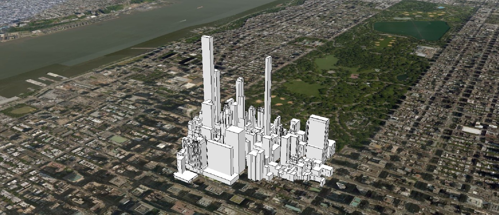
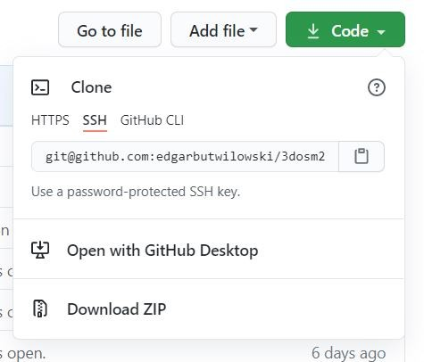

# 3D-Gebäude aus OSM in Cesium.js - leicht gemacht

**3D-Gebäude aus der OpenStreetMap-Plattform (OSM) können in Cesium.js nun auch ohne ein "Cesium ion"-Konto leicht eingebunden werden.**

Cesium.js ist eine JavaScript-Bibliothek zur Visualisierung von 3D-Stadtmodellen im Webbrowser. Es erfreut sich immer grösserer Beliebtheit, da es sich um ein OpenSource-Projekt handelt und die Zugangshürden damit sehr gering sind. Ausserdem benötigt Cesium.js nichts weiter als einen modernen Webbrowser um zu funktionieren - selbst auf dem Smartphone. Es müssen keine Plugins oder ähnliches im Browser installiert werden. Dadurch ist eine auf Cesium.js basierende Anwendung auch für den Endanwender sehr zugänglich. Zugleich ist diese Bibliothek hoch leistungsfähig, sowohl in der Funktionalität als auch in der Performance. Cesium.js ist eine wunderbare Plattform für kommende Smart-City-Anwendungen in den Städten der Zukunft. Hier ein Beispiel für die Visualisierung mit der Skyline von New York Manhatten:

[Cesium Manhatten Sandcastle](https://sandcastle.cesium.com/?id=3d-tiles-feature-picking)

Jede Anwendung wird aber erst mit den Daten, die sie verarbeitet, wirklich nutzbringend. Und hier kommt OpenStreetMap (OSM) ins Spiel, denn OSM bietet eine freie Datenbank von weltweit gesammelten Daten zu geografischen Objekten. Die Daten werden von ehrenamtlichen Helfern nach dem Wikipedia-Prinzip zusammengetragen und kostenlos bereitgestellt. Unter anderem enthält die Datenbank einen beeindruckenden Bestand an 3D-Gebäuden.

Allerdings, die Einbindung und Darstellung von Gebäuden aus der freien OSM-Datenbank in Cesium.js ist eine Spezial-Funktion, die ein "Cesium ion"-Konto benötigt. Nicht jeder möchte so ein Konto anlegen. Wenn Sie einfach nur ein paar wenige Gebäude in Cesium darstellen und nicht gleich ein Konto anlegen möchten, habe ich etwas für Sie programmiert: "3dosm2cesiumjson".

https://github.com/edgarbutwilowski/3dosm2cesiumjson

"3dosm2cesiumjson" ist ein Webservice, der 3D-Gebäude aus OSM holt und diese in ein Format umwandelt, das von Cesium verstanden wird. Auf diese Weise können Sie Gebäude aus OSM in Cesium darstellen. Der Quelltext meines Programms ist OpenSource und unter der MIT-Lizenz. Das heisst, Sie dürfen das Programm und den Quelltext beliebig verwenden, auch für kommerzielle Zwecke.

Um den Service betreiben zu können, benötigen Sie vorab eine Installation von . Sie können "3dosm2cesiumjson" von Github lokal auf Ihren Rechner herunterladen, indem Sie "Download ZIP" unter "Code" auf dem Github-Repository von "3dosm2cesiumjson" klicken:



Nachdem Sie "3dosm2cesiumjson" lokal gespeichert und entpackt haben, können Sie die Befehlszeile im entpackten Ordner öffnen und den folgenden Befehl zum Starten absetzen:

```bash
node index.js
```

Dies wird den Service auf dem Port _3000_ auf Ihrem PC starten. [CORS](https://de.wikipedia.org/wiki/Cross-Origin_Resource_Sharing) ist in diesem Server bereits aktiviert, sodass Sie den Service von jedem beliebigen Client aus starten können.

Nun können Sie Ihren Web-Browser öffnen und folgende URL in der Adressleiste eingeben:

```
http://localhost:3000?bbox=bbox=-73.98176,40.76253,-73.97499,40.76821&baseheight=0
```

Dies retourniert ein Cesium.js-JSON von ein paar Gebäuden in Manhatten NY. Sie müssen den `baseheight`-Wert immer angeben bzw. anpassen. Dieser Wert bestimmt die Höhe (über dem Meeresspiegel) der Basislinien aller Gebäude, die durch die Web-Anfrage zurück geliefert wurden. Wenn die Gebäude Ihres Interesses also auf einer Höhe von 300 Metern liegen, wäre `baseheight=300`.

Des Weiteren müssen Sie das "Minimal Umschreibende Rechteck" (auch "Bounding Box" genannt) Ihrer Anfrage im Parameter `bbox` spezifizieren. Die `bbox` wird durch zwei Koordinaten bestimmt, die den Punkt links unten und rechts oben (in dieser Reihenfolge) angeben. Die Koordinaten sind im Format WGS84 in der Reihenfolge Längengrad, Breitengrad. Versuchen Sie eher eine kleinere Bounding Box anzugeben, um den OSM-Export-Service zu schonen. Die Bounding-Box-Koordinaten können Sie interaktiv über die OSM Web Map im folgenden Link bestimmen:

https://www.openstreetmap.org/export

Sie können das resultierende JSON direkt in einen Cesium.js-Client integrieren, indem Sie folgendes Code-Beispiel Client-seitig im Browser verwenden:

```javascript
fetch("http://localhost:3000?bbox=-73.98176,40.76253,-73.97499,40.76821&
               baseheight=500")
   .then(serviceResponse => serviceResponse.json())
   .then(cesiumData => {
      for(let cesiumEntity of cesiumData){
        cesiumEntity.polygon.hierarchy =
           Cesium.Cartesian3
             .fromDegreesArray(cesiumEntity.polygon.hierarchy);
        viewer.entities.add(cesiumEntity);
      }
  });
```

Das viewer-Objekt in diesem Code-Schnipsel ist vom Typ Cesium.Viewer.

Was mich an diesem kleinen Projekt besonders begeistert hat, ist wieder einmal die Leistungsfähigkeit einer dynamisch (bzw. nicht) typisierten Programmiersprache wie JavaScript. Dieser Web-Server vollführt eigentlich eine recht ansehnliche Aufgabe, der Quelltext dazu braucht aber nur ca. _100_ Zeilen und weist eine erfrischende Leichtigkeit auf.

Ich bleibe weiterhin der Ansicht, dass komplexe Software-Projekte eine stark typisierte Sprache brauchen, da man sonst irgendwann in "Teufels Küche" kommt. Aber in manchen Fällen, insbesondere bei der Transformation von Daten von einem Format in ein anderes, kann dynamische Typisierung sehr entlastend sein. Dieser Web-Service ist ein Beispiel dafür.
