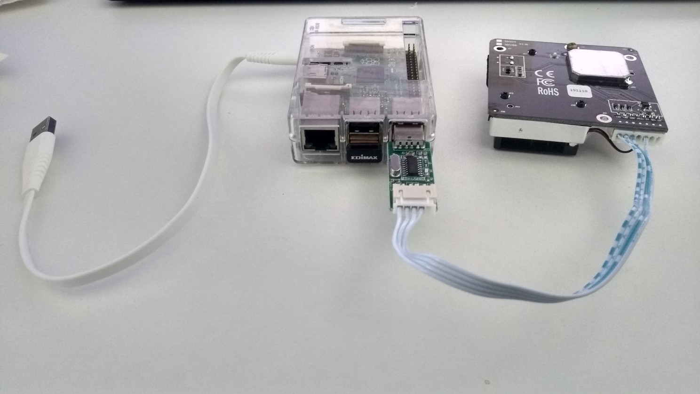
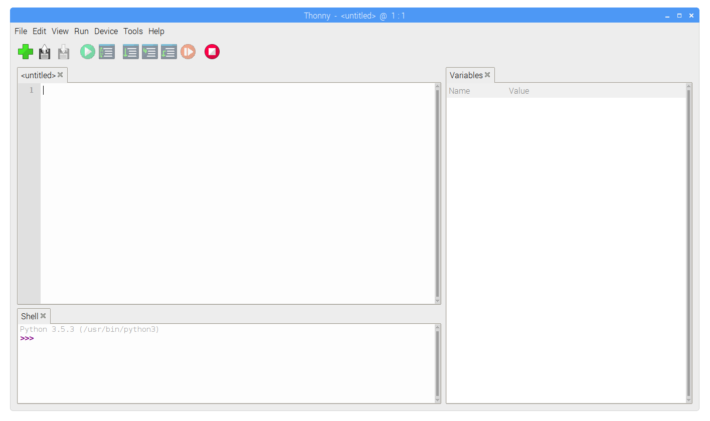
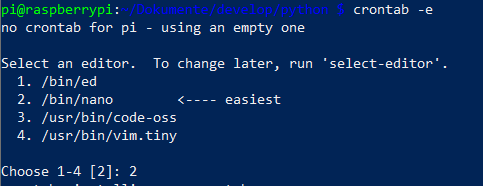
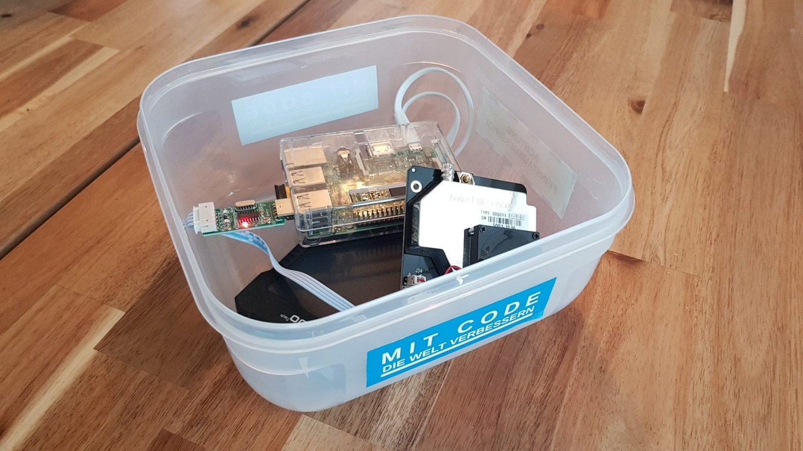
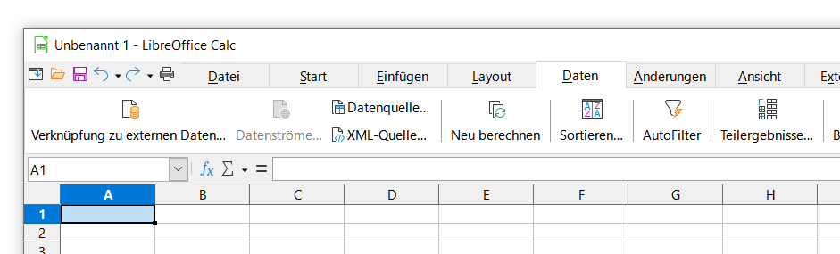
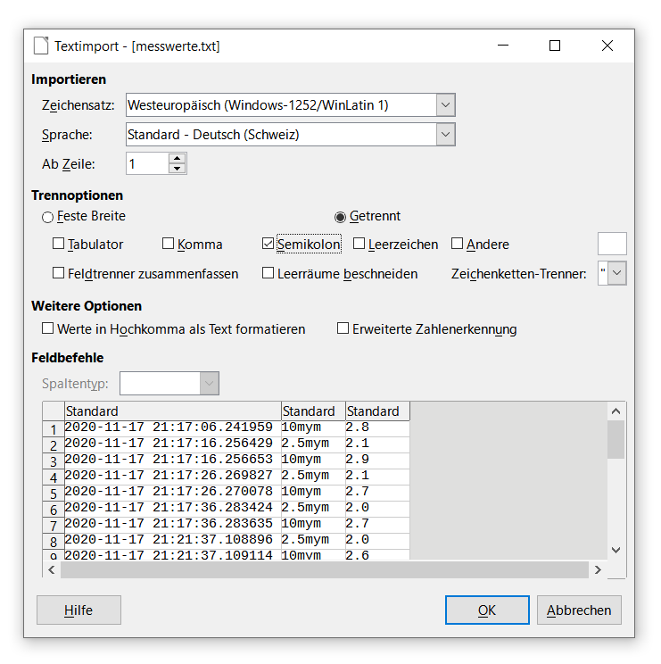
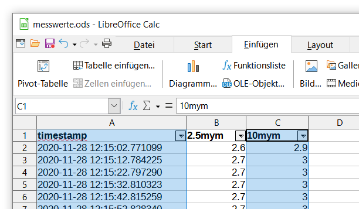
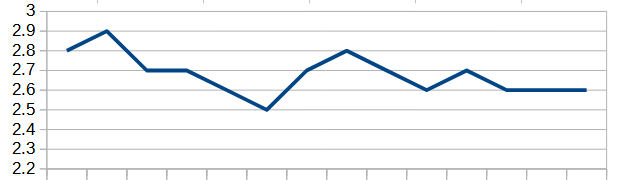

_Bildquelle: radoma/stock.adobe.com_

# Bauen Sie Ihr eigenes Internet-of-Things-Endgerät zur Messung der Feinstaub-Belastung

**Unsere Luft ist unsichtbar. Wir atmen sie tief in unsere Lungen, Tag für Tag. Doch was genau befindet sich eigentlich darin? Oft sind es Dinge, die unsere Sinne nicht erfassen können. Feinstaub zum Beispiel. Das "Internet of Things" (IoT) – also die Vernetzung von kleinen, intelligenten Geräten – gibt uns eine Art neuen Sinn. Es erlaubt uns, das Unsichtbare sichtbar zu machen. In diesem Workshop bauen wir gemeinsam ein solches "Sinnesorgan": Ein eigenes Messgerät auf Basis eines Raspberry Pi, mit dem wir die Feinstaub-Belastung direkt vor unserer eigenen Haustür messen können.**

Dass solche kleinen, vernetzten Geräte nicht nur eine technische Spielerei sind, sondern unser Leben tatsächlich verbessern können, beschreibt der Entwickler _Scott Hanselman_ sehr eindrücklich in einem Vortrag aus dem Jahr 2015 (Englisch):

> **📺 Video-Beitrag**
>
> **Thema:** Scott Hanselman's best demo! IoT, Azure, Machine Learning  
> **Link:** [▶ Video auf YouTube öffnen](https://www.youtube.com/watch?v=u5oTz1e5qqE)
>
> _Hinweis: Durch Klicken auf den Link verlassen Sie diesen Artikel und werden zu YouTube weitergeleitet. Dort gelten die Datenschutzbestimmungen von Google._

Das Messen von Feinstaub ist ein wunderbares Beispiel dafür, wie Technologie uns allen dienen kann. Wenn wir Bürgerinnen und Bürger anfangen, unsere Umwelt selbst zu vermessen, schaffen wir eine gemeinsame, sachliche Grundlage. Das nennt man *Citizen Science* – Bürgerwissenschaft. Solche Projekte erfreuen sich völlig zu Recht immer grösserer Beliebtheit, denn sie stärken die Teilhabe und helfen uns, unsere Städte lebenswerter zu machen. Lassen Sie uns also gemeinsam loslegen!

Für ein solches Unterfangen brauchen wir im Grunde nur einen kleinen, genügsamen Computer. Der Raspberry Pi ist dafür geradezu prädestiniert. Er ist klein, sparsam und offen für alle möglichen Erweiterungen. Ein echtes Werkzeug für die Praxis.

Ich setze für diesen Workshop voraus, dass Sie bereits einen lauffähigen Raspberry Pi vor sich liegen haben und die grundlegenden Schritte kennen. Ich habe für meinen Versuch einen älteren Raspberry Pi 2 Model B verwendet – ein aktuellerer Pi 3 oder 4 funktioniert natürlich genauso gut. Das eigentliche Herzstück, sozusagen unsere Nase in den Wind, ist dieser Sensor:

* Feinstaubsensor "nova PM sensor" Typ SDS011, ca. 17 CHF

Der Sensor misst Feinstaub in zwei wichtigen Grössenordnungen: 2.5 Mikrometer (μm oder "PM2.5") und 10 Mikrometer ("PM10"). Das sind winzige Partikel, viel dünner als ein menschliches Haar. Die Messqualität dieses Sensors ist für unsere Zwecke absolut beachtlich. Vergleiche durch Initiativen wie [influenceair](https://influencair.be/accuracy-of-the-sds011/) und [hackAir](https://www.hackair.eu/how-accurate-are-the-hackair-sensors/) haben gezeigt, dass er sich vor teureren Profigeräten nicht verstecken muss.

Das Gerät liefert uns die Messwerte in einer etwas sperrigen Einheit: dem zehnfachen Mikrogramm pro Kubikmeter ($10 \cdot \mu g/m^3$). Misst der Sensor bei der Korngrösse 2.5 μm also einen Wert von 32, bedeutet das übersetzt: In einem Kubikmeter Luft schweben 3.2 Mikrogramm Feinstaub dieser feinen Partikel.

Um unsere Messstation wirklich unabhängig und mobil zu machen, empfehle ich noch eine Powerbank. So können Sie Ihre Messungen auch draussen im Grünen oder an einer befahrenen Strasse durchführen:

* Optional: Powerbank "Innoo Tech Portable Solar Charger" mit 10000 mAh, ca. 50 CHF

Die Elektronik aufzubauen, ist denkbar einfach. Wir müssen hier nicht löten. Der nova-Sensor bringt ein USB-Kabel mit, das wir schlicht in einen der USB-Ports unseres Raspberrys stecken. Das war es auch schon mit der Hardware:



*(Auf meinem Foto hat der Raspberry noch einen WiFi-Dongle und das Stromkabel zur Powerbank eingesteckt. Das WLAN-Modul ist praktisch für den kabellosen Zugriff, für die eigentliche Messung aber nicht zwingend erforderlich.)*

Der Sensor zieht seinen Strom direkt über das USB-Kabel. Sobald der Pi läuft, erwacht auch der Sensor zum Leben und misst. Aber wie kommen wir nun an diese Daten heran? Hier müssen wir dem Computer, unserem Raspberry Pi, mitteilen, was er tun soll. Wir programmieren ihn.

Die Sprache, die wir dafür verwenden, ist _Python_ – eine wunderbar lesbare und klare Programmiersprache. Der Raspberry Pi bringt dafür schon alles Nötige mit: Den Python-Interpreter und eine handliche Entwicklungsumgebung namens _Thonny Python IDE_. 

Bevor wir den Code schreiben, müssen wir Python noch eine Erweiterung spendieren, damit es mit der USB-Schnittstelle "sprechen" kann. Diese Bibliothek heisst _pyserial_. Öffnen Sie dazu bitte die Befehlszeile (_Terminal_) auf Ihrem Raspberry und geben Sie diesen Befehl ein:

```bash
pip3 install pyserial
```

Öffnen Sie danach die Thonny Python IDE. Sie finden sie im Hauptmenü unter dem Himbeer-Symbol in der oberen linken Ecke:

_Himbeer-Symbol => Entwicklung => Thonny Python IDE_

Vor uns liegt nun unser Arbeitsplatz:



Die Oberfläche ist aufgeräumt: Oben links schreiben wir unseren Code, rechts sehen wir unsere Variablen, und unten links befindet sich die _Shell_, die Konsole. Stellen Sie sicher, dass unten in der Shell "Python 3..." steht.

Hier ist das Skript, das für uns die Arbeit übernimmt. Es ist kurz und bündig:

```python
import serial, time
import datetime

ser = serial.Serial('/dev/ttyUSB0')

while True:
    data = []
    for index in range(0,10):
        datum = ser.read();
        data.append(datum)
        
    zweikommafuenf = int.from_bytes(b''.join(data[2:4]), byteorder='little') / 10 
    zehn = int.from_bytes(b''.join(data[4:6]), byteorder='little') / 10
    
    messwerteDatei = open("/home/pi/Dokumente/develop/python/messwerte.csv", "a")
    messwerteDatei.write(str(datetime.datetime.now()) + ";" + \
        str(zweikommafuenf) + ";" + str(zehn) + "\r\n")
    messwerteDatei.close()
    
    time.sleep(10)
```

Tippen Sie den Text in das linke obere Fenster ein und speichern Sie ihn. Suchen Sie sich einen passenden Ordner, zum Beispiel unter dem Namen _feinstaub.py_. Vergessen Sie nicht die Endung `.py`. Bei mir liegt die Datei hier:

```bash
/home/pi/Dokumente/develop/python/feinstaub.py
```

Lassen Sie uns kurz schauen, was dieser Code eigentlich bewirkt. Zunächst (`serial.Serial`) öffnen wir den Datenkanal zum USB-Anschluss. Dann betritt das Skript eine Endlosschleife (`while True:`): Es lauscht beständig auf die Schnittstelle und liest Stück für Stück zehn Daten-Bytes pro Durchgang. 
Die für uns spannenden Werte verbergen sich im Datenstrom: An der dritten und vierten Stelle (`[2:4]`) liegt der Messwert für die *2.5 μm*-Partikel, an der fünften und sechsten Stelle (`[4:6]`) der Wert für die *10 μm*-Partikel. Der Computer fügt diese winzigen Datenhäppchen zu einer ordentlichen Zahl zusammen.

Damit wir die etwas umständliche Einheit des Sensors in unser vertrautes Mikrogramm übersetzen, teilen wir den Wert durch 10. Anschliessend protokolliert das Programm das aktuelle Datum, die Uhrzeit und die beiden Messwerte ordentlich getrennt durch ein Semikolon in einer eigenen Datei namens `messwerte.csv`. Nach jedem Eintrag legt das Skript für zehn Sekunden eine kleine Pause ein (`time.sleep(10)`), bevor es von neuem misst.

Wenn Sie nun in Thonny oben auf den "Play"-Button drücken, beginnt die Aufzeichnung. Nach einiger Zeit sieht unsere `messwerte.csv`-Datei dann in etwa so aus:

```csv
2020-11-08 22:50:38.196183;3.2;4.8
```
Links die genaue Zeit, in der Mitte der *PM2.5*-Wert, ganz rechts der *PM10*-Wert.

Ein Wert von *4.8* – das ist typisch für einen Ort mit relativ guter Luftqualität, wie etwa auf dem Land oder im kleinen Schweizer Örtchen Steckborn. Um das greifbarer zu machen: Im städtischen Singen habe ich an einem normalen Samstag Werte von *10 μg/m^3* (PM10) gemessen. Es gibt aber auch Regionen auf der Welt, da atmen Menschen tagtäglich Luft ein, die Werte von über *400 μg/m^3* erreicht. Darauf kommen wir gleich noch zurück.

Sie können unser kleines Skript übrigens auch ganz ohne grafische Oberfläche aus einem Terminalfenster starten:

```bash
python3 /home/pi/Dokumente/develop/python/feinstaub.py
```

Ein Messgerät ist natürlich dann am besten, wenn es einfach so funktioniert, ohne dass wir jedes Mal einen Monitor anschliessen müssen. Wir bringen dem Raspberry Pi also bei, unser Skript bei jedem Hochfahren von selbst zu starten. Wir öffnen das Terminal und tippen:

```bash
crontab -e
```

Das System fragt uns nun (meist beim ersten Mal), welchen Texteditor wir verwenden möchten. Am einfachsten ist "Nano". Im Bild unten wäre das die Option "2", die wir mit _[ENTER]_ bestätigen:



Im Editor fügen wir ganz unten die Anweisung ein, die unserem Raspberry Pi sagt: "Beim Start (`@reboot`) führst du bitte im Hintergrund (`&`) das Feinstaub-Skript aus":

```bash
@reboot python3 /home/pi/Dokumente/develop/python/feinstaub.py &
```

Mit _Ctrl+X_, der Taste "j" und _[ENTER]_ speichern und schliessen wir die Datei. Wenn Sie den Pi nun neu starten, beginnt er sofort, still und leise Daten für uns zu sammeln.

Damit ist unser Messgerät fertig. Wenn man es ein wenig vor Wind und Wetter schützen möchte, reicht oft schon eine einfache Frischhaltedose für den Anfang – vielleicht noch versehen mit ein paar Aufklebern:



Zahlenkolonnen in einer Datei sind zwar aufschlussreich, aber wir Menschen erfassen Dinge am besten visuell. Da wir die Daten im CSV-Format gespeichert haben, können wir sie wunderbar einfach grafisch darstellen. Ob Sie Excel oder das freie LibreOffice Calc verwenden, spielt keine Rolle. Ich zeige es hier am Beispiel vom quelloffenen LibreOffice Calc. Gehen Sie auf den Reiter "Daten" und wählen Sie:

_=> Daten => Verknüpfung zu externen Daten..._



Wählen Sie die Datei und stellen Sie im Dialog als "Trennoption" das "Semikolon" ein:



Nun sehen Sie die Spalten vor sich. Wir fügen noch schnell eine Titelzeile ein ("timestamp", "2.5mym", "10mym") und markieren die Spalten "timestamp" sowie "10mym":



Jetzt geht es ans Zeichnen:

_=> Einfügen => Diagramm..._

Wir wählen:

_=> Liniendiagramm => Nur Linien => Fertigstellen_

Und schon entfaltet sich vor unseren Augen das Unsichtbare als sichtbare Kurve:



In diesem Testlauf schwanken die PM10-Werte über sechs Minuten hinweg gemütlich zwischen _2.5_ und _2.9 μg/m^3_. Das ist saubere Luft.

Aber wie alltagstauglich ist unser Aufbau? Ich habe die vorgeschlagene _10000-mAh_-Powerbank getestet und das Gerät bis zum Ende laufen lassen. Um den Akku zu schonen, habe ich dem Programm aber eine Pause von _10 Minuten_ (_600 Sekunden_) zwischen den Messungen verordnet:

```python
time.sleep(600)
```

Mit dieser Einstellung hielt unser Bürger-Messgerät starke _12 Stunden_ am Stück durch.

Solche Projekte sind wichtig. Sie geben uns Fakten an die Hand, um über Luftqualität zu sprechen. Denn saubere Luft ist leider nicht für alle Menschen selbstverständlich. In einigen Ballungsräumen der Welt müssen die Menschen mit Belastungen von bis zu _417 μg/m^3_ (PM 2.5) leben. Was das bedeutet, zeigt der folgende kurze Beitrag:

> **📺 Video-Beitrag**
>
> **Thema:** Most Polluted Major City On Earth  
> **[▶ Video auf YouTube öffnen](https://www.youtube.com/watch?v=mNZIdHhdQs8)**
>
> _Hinweis: Durch Klicken auf den Link verlassen Sie diesen Artikel und werden zu YouTube weitergeleitet. Dort gelten die Datenschutzbestimmungen von Google._

---

> **💾 Artikel als PDF**
>
> [▶ Artikel als PDF herunterladen](https://github.com/edgarbutwilowski/technik-und-teilhabe/blob/main/beitr%C3%A4ge/2020-12-feinstaub-iot/2020-12-feinstaub-iot.pdf)
> -

---

> **💬 Gemeinsam weiterdenken**
>
> Technik und Wissenschaft leben vom Austausch. Haben Sie Fragen zum Aufbau, eigene Erfahrungen mit solchen Messungen gemacht oder Anregungen zu unserer Datenaufzeichnung? 
>
> Ich freue mich immer über eine sachliche, offene Diskussion, denn nur gemeinsam kommen wir weiter. Lassen Sie uns auf Mastodon ins Gespräch kommen:
>
> [▶ Zum Diskussionsfaden auf swiss.social](https://swiss.social/@edgar_butwilowski/116167025003927679)
> -
