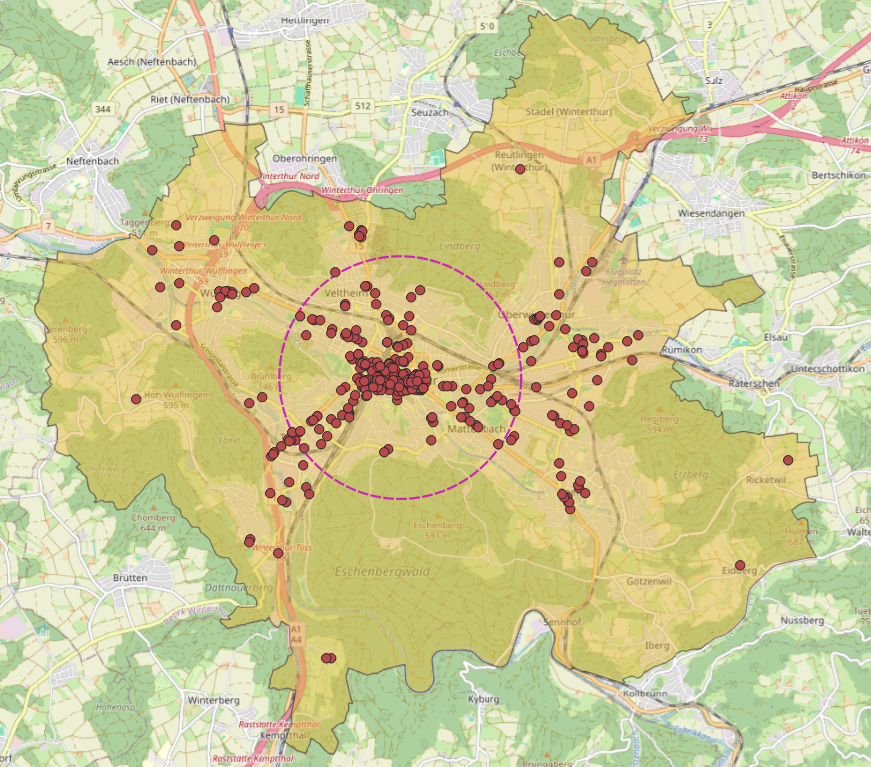
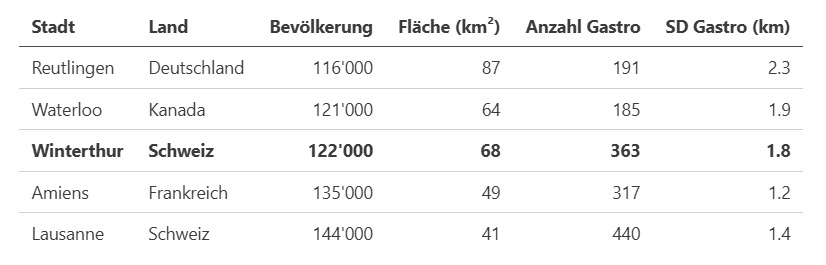

# Strategische Geoanalyse: Das Potenzial von OpenStreetMap und Python in der Praxis

Die Verfügbarkeit von offenen Geodaten, insbesondere aus **OpenStreetMap** (OSM), und leistungsfähigen Open-Source-Tools wie **Python** hat die Möglichkeiten der Geoanalyse fundamental erweitert. Das Spannende: Die für diverse Anwendungsfälle völlig ausreichende Verlässlichkeit der von Freiwilligen gesammelten OSM-Daten ist beachtlich und wurde in zahlreichen akademischen Artikeln z.B. von Haklay, Zielstra und Zipf bestätigt. Für viele Anwendungen sind sie nach dem **Prinzip "Fit for Purpose"** (also passgenau für den Anwendungszweck) absolut ausreichend und bieten eine hervorragende Zugänglichkeit.

Um die Anwendung dieser Werkzeuge in der Praxis zu illustrieren, schauen wir uns als Beispiel die Gastronomie-Szene (Restaurants, Cafés, Bars) in **Winterthur** an. Um deren räumliche Konzentration zu messen, wird die **Standarddistanz** genutzt. In Winterthur weist die Gastronomie eine Standarddistanz von _1.8 km_ auf. Die folgende Karte visualisiert die Gastronomie-Standorte (rote Punkte) und den daraus berechneten Kreis der Standarddistanz (violett), der den Kernbereich der Verteilung zeigt.

_Winterthurer Stadtgebiet mit Gastronomie-Standorten und Standarddistanz. Kartendaten: OpenStreetMap-Mitwirkende (ODbL)_

Aber was bedeutet denn nun eine Standarddistanz der Gastronomie von _1.8 km_ - ist das gut, ist das schlecht? Um die Werte richtig einordnen zu können, ist ein Vergleich mit ähnlich grossen Städten wertvoll. Ein Blick auf die Zahlen zeigt, wie ähnlich die Werte auch im internationalen Vergleich sind:

_Tabelle mit Standarddistanzen und weiteren Werten von in der Grösse mit Winterthur vergleichbaren Städten_

Die Standarddistanzen der meisten Städte dieser Grössenklasse bewegen sich in einem ähnlichen Korridor (ca. _1.2 km_ bis _2.3 km_). Winterthur liegt mit _1.8 km_ also in einem sehr **typischen Mittelfeld**. Die Daten zeigen eine klare urbane Struktur, die global vergleichbar ist. Winterthur scheint also eine "gesunde" Verteilung der Gastronomie-Standorte zu haben.

Was hätte es bedeutet, wenn die Zahl extrem abgewichen wäre? Eine **hohe Standarddistanz** (z.B. _5 km_) würde auf eine stark dezentralisierte Stadt hindeuten, vielleicht mit vielen verstreuten Nebenzentren oder einer starken Zersiedelung der Gastronomie, womöglich gar auch fehlende Urbanität. Eine **niedrige Distanz** (z.B. _0.2 km_) würde eine massive Ballung an einem einzigen Ort bedeuten, fast so, als würden sich alle Lokale in nur einer Strasse oder einem einzigen Einkaufszentrum befinden. Solch ausgeprägte Werte könnten auf Entwicklungen hindeuten, die von gängigen stadtplanerischen Zielen abweichen und eine Überprüfung nahelegen.

Solche Analysen sind weit mehr als eine technische Spielerei. Für eine moderne Stadtentwicklung ist die Fähigkeit, solche Muster zu erkennen, von strategischer Relevanz. Ob es um die Optimierung der öffentlichen Infrastruktur, die Förderung von lebendigen Quartieren oder die Standortplanung für neue Angebote geht – die Kombination aus offenen OSM-Daten und flexiblen Python-Tools, die einen Kern des **Modern Geospatial Data Stack** bilden, liefert die entscheidende Datengrundlage für fundierte, zukunftsgerichtete Entscheidungen.

Die Analyse in diesem Artikel dient der Illustration von Werkzeugen und ist keine wissenschaftliche Studie. Für eine tiefere Geoanalyse wären robustere Verfahren als die reine Standarddistanz sowie ein systematischerer Städtevergleich nötig. Die Wertung einer Verteilung als "gesund" hängt in der Praxis von spezifischen stadtplanerischen Zielen ab.

Falls Sie neugierig geworden sind und lernen möchten, wie Sie solche Geoanalysen von Grund auf mit OpenStreetMap-Daten und Python selbst durchführen können, bietet mein Buch "Einführung in Geostatistik mit Python und OpenStreetMap" einen kompakten Einstieg. Es dient als praktischer Leitfaden, um die ersten Schritte in der Geostatistik mit diesem modernen Tool-Stack zu meistern.

---

> **📖 Einführung in Geostatistik mit Python und OpenStreetMap**
>
> _Erhältlich bei diversen eBook-Händlern_
>
> **[▶ Produktseite bei Orell Füssli](https://www.orellfuessli.ch/shop/home/artikeldetails/A1076652168)**
